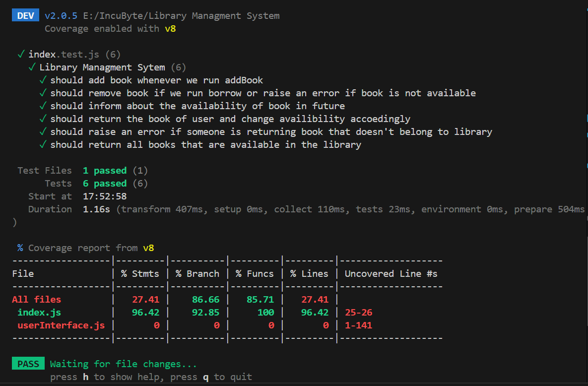

# Library Management TDD Solution

Welcome to my solution for the Library Management Kata! This repository showcases the use of Test-Driven Development (TDD) to solve a programming problem, emphasizing small, incremental commits and clear, concise code.

## Table of Contents

- [Problem Statement](#problem-statement)
- [Requirements](#requirements)
- [Solution](#solution)
- [Features](#function-descriptions)
- [Setup Instructions](#setup-instructions)
  - [Prerequisites](#prerequisites)
  - [Clone the Repository](#clone-the-repository)
  - [Running Tests](#running-tests)
- [Test Coverage](#test-coverage)

## Problem Statement

Create a simple library management system that allows users to perform basic operations such as adding books, borrowing books, returning books, and viewing available books.

### Requirements

- **Add Books**:
  - Users should be able to add new books to the library.
  - Each book should have a unique identifier (e.g., ISBN), title, author, and publication year.

- **Borrow Books**:
  - Users should be able to borrow a book from the library.
  - The system should ensure that the book is available before allowing it to be borrowed.
  - If the book is not available, the system should raise an appropriate error.

- **Return Books**:
  - Users should be able to return a borrowed book.
  - The system should update the availability of the book accordingly.

- **View Available Books**:
  - Users should be able to view a list of all available books in the library.

For a detailed problem statement and requirements, [click here](Problem%20Statement.md).

## Solution

This project follows TDD principles to solve the kata problem. The solution is built with small, incremental commits, ensuring that each feature is developed and tested in isolation, demonstrating effective TDD practices.

### Function Descriptions

- **`addBook(isbn, title, author, year)`**:
  - **Description**: Adds a new book to the library's inventory.
  - **Parameters**:
    - `isbn` (string): The ISBN of the book.
    - `title` (string): The title of the book.
    - `author` (string): The author of the book.
    - `year` (number): The publication year of the book.
  - **Returns**: A confirmation message `"Book Added"`.

- **`borrowBook(isbn, date)`**:
  - **Description**: Allows a user to borrow a book from the library.
  - **Parameters**:
    - `isbn` (string): The ISBN of the book to borrow.
    - `date` (string): The date when the book will be returned.
  - **Throws**: An error if the book is not available or if it's already borrowed.
  - **Updates**: The book's availability status and return date.
  - **Returns**: The borrowed book object.

- **`returnBook(isbn)`**:
  - **Description**: Handles the return of a borrowed book.
  - **Parameters**:
    - `isbn` (string): The ISBN of the book being returned.
  - **Throws**: An error if the book does not belong to the library.
  - **Updates**: The book's availability status and clears the return date.
  - **Returns**: A confirmation message `"Returned Successfully"`.

- **`viewBooks()`**:
  - **Description**: Provides a list of all books currently available in the library.
  - **Returns**: An array of book titles that are available for borrowing.
  - **Ensures**: The list only includes books that are not currently borrowed.

## Setup Instructions

### Prerequisites

- **NodeJS**: Ensure NodeJS installed on your machine.

### Clone the Repository

1. Open your terminal or command prompt.
2. Run the following command to clone the repository:

    ```bash
    git clone https://github.com/vinayak501/Library-Managment-System-TDD-.git
    ```

3. Navigate into the project directory:

    ```bash
    cd Library-Managment-System-TDD-
    ```
    
4. Run User Interaction Panel:

   ```bash
   node userInterface.js
   ```

### Running Tests

1. Run test :

   ```bash
   npm test
   ```
   

## Test Coverage

The current test coverage of this project is **93%**.

 
